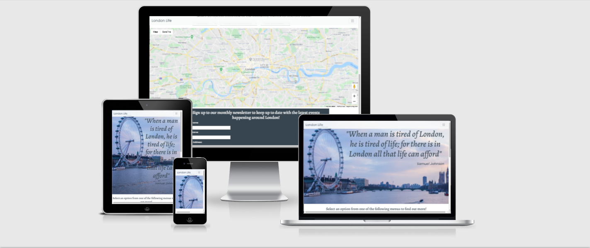
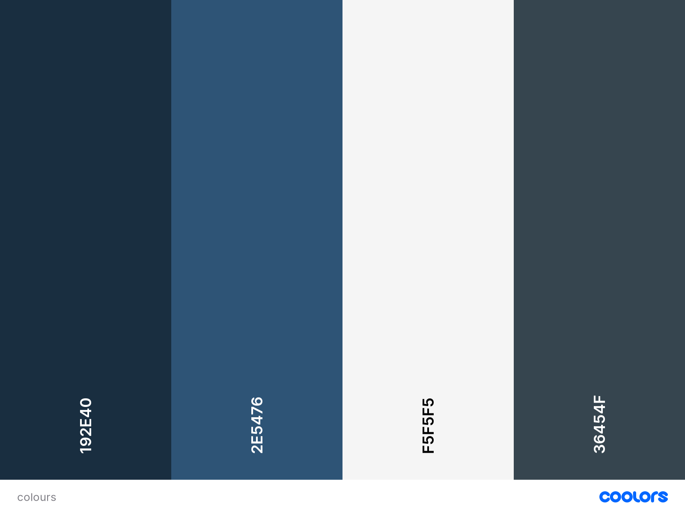

# MS2---London-Life
Second Milestone Project for Code Institute

 

I wanted to design a website with an interactive map at the heart of it. I chose the Google Maps API as it widely used around the world.

---

# UX
## User Stories
- User goals 
    - As a user, I want to immediately understand what is offered by the website
    - As a user, I want to be able to seamlessly navigate through the site to easily find
     more information
    - As a user, I want to be able to easily interact with the site

    I made the wireframe using Balsamiq which you can view the wireframe [here.](assets/docs/London-Life-Wireframe.pdf)

## Design Choices
---
When designing this website I looked at existing travel and tourism sites such as [this LA tourism site](https://www.discoverlosangeles.com/) for inspiration. 
I opted for a single scrolling page with a fixed navbar to easily navigate the page.

## Fonts
I chose [Alegreya](https://fonts.google.com/specimen/Alegreya?preview.text_type=custom) for my headings as I wanted something that
would immediately stand out and be noticeable. I chose [Poppins](https://fonts.google.com/specimen/Poppins?preview.text_type=custom#standard-styles)
for my main font as I found that it contrasted well and looks very clean.

## Icons
I used [Font Awesome](https://fontawesome.com/) for social media links in the footer.

## Colours
I chose #36454f for my signup form background, to contrast that I used #f5f5f5 for my form text colour. 
For my navbar and submit button I used #2E5476 as a hover effect colour,
I also used #36454f for the icons using #192e40 as a hover effect colour for the social media icons in the 
footer.

# Features
- Fixed navbar making navigation intuitive and simple
- Interactive Google Maps API with dropdown menus to plot markers with info windows
- Contact form 
- Social media links

## Future Features
- More map interactivity
- EmailJS for the signup form

# Technologies used
## Languages used
- [HTML5](https://en.wikipedia.org/wiki/HTML)
- [CSS3](https://en.wikipedia.org/wiki/CSS)
- [JavaScript](https://en.wikipedia.org/wiki/JavaScript)

## Tools, Frameworks and Libraries used
- [Git](https://git-scm.com/)
- [Font Awesome](https://fontawesome.com/)
- [Bootstrap](https://getbootstrap.com/)
- [Google Fonts](https://fonts.google.com/)
- [Balsamiq](https://balsamiq.com/) 

# Testing
I used the [CSS Validator](https://jigsaw.w3.org/css-validator/) and the [JS Validator](https://esprima.org/demo/validate.htm) which passed with no errors. I also 
used the [HTML Validator](https://validator.w3.org/) which brought up the following errors:
- Section lacks heading. From line 94, column 5; to line 94, column 25

### Fixes
- Given that the Map is a section in it's own right I don't feel the need to add a heading as I think it will detract from the flow of the page.

# Bugs
Following on from Testing I also encoutered these bugs, below each one are the
relevant fixes. 
## During development
- Signup form refused to center despite Bootstrap grid and CSS styling
    - Shift + f5 to clear the cache 
- Google Maps markers and info windows not appearing in the map
    - Tutor Support, my mentor and Stack Overflow helped me decipher where I was going wrong

# Deployment

**London Life** was developed on Gitpod, using GitHub to host the repository.
These were the steps taken to successfully deploy the website.
- Open [**GitHub**](https://github.com/) and log in
- Select the **repository**
- Click the **Settings** button from the top menu
- Scroll down to the **GitHub pages** section
- Click the **Source** dropdown menu and select **Main Branch**
- After the page has refreshed the link to the website can now be found 
under the **GitHub pages** section

## Cloning the Website
- Open [**GitHub**](https://github.com/) and log in
- Select the **repository**
- Click the **Code** drop down button next to the green GitPod one
- Select **"Clone with HTTPS"** and copy the link
- Open your **IDE** and the **Terminal**
- Specify a new **path directory** where you want to put the clone
- Type `git clone` and then **paste** the previously copied url from before

# Credits

## Code
- I used [Bootstrap 4](https://getbootstrap.com/) to make the site
responsive on different devices.
 
## Images
- The hero background image came from
[Pexels.](https://www.pexels.com/photo/sunset-river-london-thames-34632/)

## Websites

- I used [ResizeImage](https://resizeimage.net/) to help get the hero image
to display properly.

# Special Thanks
Special thanks to the Slack community, Stack Overflow, Tutor Support and my Mentor for all their advice and guidance on this project.
